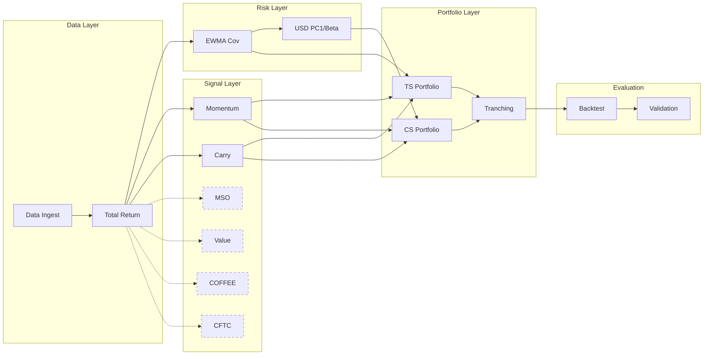

# Synthesis: fx_cookbook

> Source: Deutsche Bank Quantcraft, "FX Cookbook: A Recipe for Systematic Investing in Currency Markets", Jan 2019
> Pipeline stage: synthesise | Date: 2026-03-09

## Core Claim

The FX Cookbook demonstrates that non-profit-seeking participants (corporate hedgers, central banks, passive flows) create persistent, exploitable return predictability across 24 USD/FX pairs at three horizons, harvestable via 7 signals (momentum, carry, value, MSO, COFFEE, CFTC continuation, CFTC reversal) with Sharpe ratios of 0.33–0.79 after transaction costs.

## Method Decomposition

| # | Component | Type | Inputs | Outputs | Parallelisable? |
|---|-----------|------|--------|---------|-----------------|
| C1 | **Data Ingest** | ETL | Raw CSV/parquet (spot, fwd, spreads) | Validated DataFrame: (date, asset, total_return, bid_ask_spread) | N/A |
| C2 | **Total Return** | Transform | spot_rate, forward_1m | total_return = spot_return + daily_carry | Per-asset |
| C3 | **EWMA Covariance** | Risk | returns (N×T) | Covariance matrix (N×N) | Per-offset (3 offsets) |
| C4 | **Momentum Signal** | Alpha | returns, lookback range | raw_signal, dispersion, hysteresis, final_signal | Per-asset (hysteresis sequential in time) |
| C5 | **Carry Signal** | Alpha | spot, forward, vol | carry_signal | Per-asset |
| C6 | **MSO Signal** | Alpha | IR spreads, windows | mso_signal | Per-asset |
| C7 | **Value Signal** | Alpha | REER, GDP, ToT | value_signal | Per-panel (5 panels) |
| C8 | **COFFEE Signal** | Alpha | DTCC options flow | coffee_signal | Per-asset |
| C9 | **CFTC Signals** | Alpha | CoT positioning | continuation + reversal signals | Per-asset |
| C10 | **USD PC1 / Beta** | Risk | returns | PC1 loadings, betas | Sequential (eigendecomp) |
| C11 | **TS Portfolio** | Construction | signals, volatilities | IVW weights (directional) | Per-signal |
| C12 | **CS Portfolio** | Construction | signals, betas | Beta-neutral weights (long/short) | Per-signal |
| C13 | **Tranching** | Execution | target weights | daily-rebalanced tranched weights | Sequential |
| C14 | **Backtest** | Evaluation | weights, returns, costs | PnL, metrics | Sequential |
| C15 | **Validation** | Statistics | PnL series | Sharpe t-test, GO/NO_GO | N/A |

### Scope (v1.0)

**IN-SCOPE:** C1–C5, C10–C15 (momentum + carry, both TS and CS portfolios)
**OUT-OF-SCOPE:** C6 (MSO), C7 (Value), C8 (COFFEE), C9 (CFTC) — deferred until core signals validated

## Dependency Graph

**Critical path:** C1 → C2 → C3 → C10 → C12 → C13 → C14 → C15

All signals (C4–C9) are embarrassingly parallel once C2 is done.

## Implementation Decisions

### Decision 1: EWMA decay → alpha mapping (LOAD-BEARING)

The paper says "decay = 252 days" for diagonal variance but never defines the mapping.

| Approach | Formula | Trade-off |
|----------|---------|-----------|
| **Exponential decay** | `α = 1 - exp(-1/decay)` | Continuous-time interpretation. **Chosen.** |
| **Halflife** | `α = 1 - 0.5^(1/decay)` | Standard RiskMetrics convention. Different α values. |
| **Span** | `α = 2/(decay+1)` | Pandas `.ewm(span=)` convention. Most aggressive weighting. |

**Impact:** α differs by ~2x between approaches at decay=252. Directly affects all position sizing.
**Resolution:** Exponential decay chosen; documented in SPEC_CHANGE_REQUEST_v1.3.

### Decision 2: 3-day non-overlapping return aggregation

| Approach | Method | Trade-off |
|----------|--------|-----------|
| **Sum** | `r_3d = r_1 + r_2 + r_3` | Linear, simple. **Chosen.** |
| **Compounded** | `r_3d = (1+r_1)(1+r_2)(1+r_3) - 1` | More accurate for large moves. |
| **Log** | `r_3d = ln(1+r_1) + ln(1+r_2) + ln(1+r_3)` | Symmetric. Theoretical appeal. |

**Impact:** Low for daily FX returns (~0.5%). Sum is adequate.
**Resolution:** Sum chosen; documented in SPEC_CHANGE_REQUEST_v1.3.

### Decision 3: Dispersion floor computation

| Approach | Method | Trade-off |
|----------|--------|-----------|
| **Cross-sectional per day** | `floor_t = np.percentile(σ_t, 25)` | Day-specific. Can be noisy with 24 assets. **Chosen.** |
| **Rolling window** | `floor_t = rolling_percentile(σ, 63, 25)` | Smoother. Introduces lookback dependency. |
| **Expanding** | `floor_t = expanding_percentile(σ, 25)` | Most stable. Slow to adapt. |

**Impact:** Medium. Floor prevents signal hyper-inflation in low-dispersion regimes.

### Decision 4: Quote convention handling (LOAD-BEARING)

| Approach | Method | Trade-off |
|----------|--------|-----------|
| **Invert at load** | Flip spot/forward for FX/USD pairs | Simple. **Chosen** (adapter layer). |
| **Store both** | Keep original + USD-normalised | Auditable but doubles storage. |
| **Convention flag per asset** | Config-driven per currency | Most flexible. Adds complexity. |

**Impact:** Getting this wrong flips carry signal signs for EUR, GBP, AUD, NZD.

### Decision 5: Beta-neutral optimisation solver

| Approach | Method | Trade-off |
|----------|--------|-----------|
| **Analytical (Lagrange)** | `w = w̃ - (w̃·β / β·β) * β` | Exact, fast. **Chosen.** |
| **scipy.optimize** | Generic QP solver | Flexible for additional constraints. |
| **cvxpy** | Disciplined convex programming | Most readable. Adds dependency. |

**Impact:** Low — single equality constraint on a quadratic. Analytical solution is trivial.

## What's Missing

### Numerical Stability
- **Singular covariance:** 24 assets, ~80 obs/year with 3-day aggregation → 300 free parameters from 80 data points. Need eigenvalue floor or Ledoit-Wolf shrinkage. Paper doesn't mention regularisation.
- **Carry division-by-zero:** If forward = spot exactly, carry = 0/F = 0 (benign), but if vol = 0, carry/vol → ∞. Guard with `.replace(0, np.nan)`.
- **Hysteresis initialisation:** `Ŝ₀` undefined. Implementation uses 0.0; first valid signal overrides.
- **EWMA warm-up:** Variance starts at zero, needs ~3×decay observations to stabilise. Early estimates unreliable.

### Edge Cases
- **Missing currencies:** EM holidays when G10 trades. Cross-sectional signals need partial-universe handling.
- **Short history:** New currencies entering mid-sample lack sufficient lookback. Needs `min_periods`.
- **Total return NaN:** First observation per currency is NaN from `pct_change()`. Must handle at data loading.

### Scaling
- **Tranching:** 20 daily tranches = stateful tracking across days. Complicates backtesting significantly.
- **Multi-signal combination:** Paper shows individual signal performance but is vague on combining momentum + carry into a single portfolio. Equal risk contribution? Simple average?

### Data Sourcing
- **COFFEE:** DTCC high-delta option flow. Proprietary, expensive, history only from 2014. Effectively un-implementable.
- **Value:** BIS REER + GDP + ToT. Quarterly with 2-month publication lag. Complex pipeline.
- **CFTC:** Weekly snapshots, 4-day reporting lag. Discretisation error is material (paper warns explicitly).

## Stress Test

### Most likely to fail: EWMA Covariance (C3)

1. **Dimensionality:** 24×24 matrix from ~80 effective obs/year → statistically unreliable
2. **Regime shifts:** FX correlations spike in crises (2008, 2020) — exactly when the estimate matters most. Fixed-decay EWMA can't adapt.
3. **Cascading impact:** Covariance feeds volatility → position sizing (C11), PC1 → beta neutralisation (C12), carry risk-adjustment (C5). Wrong covariance → everything downstream is wrong.
4. **No regularisation:** Raw EWMA covariance without shrinkage risks near-singular matrices.

### Second: Hysteresis (part of C4)

Path-dependent signal: current position depends on entire history of threshold crossings.
- Backtests sensitive to start date
- Small threshold changes flip positions for extended periods
- Signal can be "stuck" long after raw signal reversed (gradual reversals)

## Chosen Approach

Implement momentum (C4) + carry (C5) first as the minimal viable backtest, with EWMA covariance (C3) using exponential decay mapping (`α = 1 - exp(-1/decay)`). Defer value/MSO/COFFEE/CFTC until core signals reproduce reported Sharpe within 0.1.

## Load-Bearing Assumptions

- EWMA decay → alpha uses `α = 1 - exp(-1/decay)` (not halflife, not span)
- 3-day returns are summed, not compounded
- Quote convention inversion is correct for all 24 pairs
- Dispersion floor computed cross-sectionally per day
- Hysteresis threshold 1/3 is pre-registered (not tuned)
- Transaction costs = 1.5× historical average bid-ask spread

## Provenance Summary

| Category | Count | Examples |
|----------|-------|---------|
| From paper | 15 | Signal formulas (Eq 0–7), IVW weights (Eq 10), beta neutralisation (Eq 11), hysteresis (Eq 3) |
| Inferred | 5 | EWMA alpha mapping, 3-day aggregation method, dispersion floor method, hysteresis init, warm-up handling |
| Design choice | 3 | Adapter layer, canonical schema, analytical Lagrange solver |
