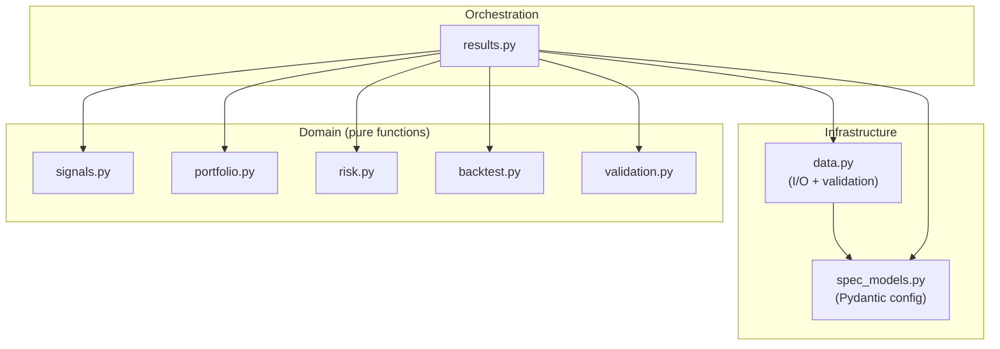

# Architecture Review Report (Post-Refactor)

**Project:** fx_cookbook
**Date:** 2026-03-08
**Files reviewed:** 9 source modules (794 lines), 9 test files (547 lines)
**Overall health:** 🟢 Strong

## Codebase Summary

The fx_cookbook package implements a momentum-based FX trading strategy from the Deutsche Bank FX Cookbook paper. It is structured as a flat package of 8 domain modules (`signals`, `portfolio`, `risk`, `backtest`, `validation`, `data`, `spec_models`) plus one orchestrator (`results`). Entry point is `results.run_results()` which chains data loading → signal generation → portfolio construction → backtesting → validation → output writing. Configuration uses Pydantic models loaded from `config.yaml`. Tests (29 total) cover each module independently via a shared `tests/utils.py` fixture factory. The package is installed editably via `pyproject.toml`.

## Scorecard

| Dimension | Score | Key Finding |
|---|---|---|
| Boundary Quality | 🟢 | Clear single-responsibility modules with domain-aligned names |
| Dependency Direction | 🟢 | Clean DAG; domain modules have zero internal imports |
| Abstraction Fitness | 🟡 | `data.py` bundles I/O, validation, and return computation; `spec_models.py` is a thin wrapper |
| DRY & Knowledge | 🟡 | `252` annualisation factor hardcoded in 3 locations; column names scattered |
| Extensibility | 🟡 | New signal = 2-3 files; new data source = 3 files; no registry pattern |
| Testability | 🟢 | All domain modules unit-testable in isolation; good edge case coverage |
| Parallelisation | 🟡 | `build_cs_weights` iterates dates serially; `_compute_sign_stack` loops lookbacks |

**Overall: 🟢 Strong — clean architecture with minor knowledge-duplication and abstraction-fitness issues that don't impede current development**

## Dependency Graph

No ⚠️ annotations: all edges follow correct dependency direction (orchestrator → domain → infrastructure).

## Detailed Findings

### AR-BND-001: data.py bundles three distinct responsibilities

- **Finding ID:** AR-BND-001
- **Dimension:** Boundary Quality
- **Severity:** 🟡
- **Location:** `data.py` (139 lines)
- **Principle violated:** Single Responsibility
- **Evidence:** `data.py` contains: (1) file I/O providers (`LocalCSVProvider`, `LocalParquetProvider`), (2) schema validation (`_validate_schema`, `_REQUIRED_COLUMNS`), (3) return computation (`_compute_total_return`, `_apply_quote_convention`). These have different change rates — I/O providers change when data sources change, validation changes when the schema changes, return computation changes when the financial model changes.
- **Impact:** Low at current scale (139 lines is manageable), but the module will grow if new providers or transformations are added.
- **Recommendation:** Monitor. If any of the three sub-responsibilities grows past ~50 lines, extract it. Not worth splitting at current size.

### AR-DRY-001: Annualisation factor 252 hardcoded in 3 locations

- **Finding ID:** AR-DRY-001
- **Dimension:** DRY & Knowledge
- **Severity:** 🟡
- **Location:** `backtest.py:78,81,92` and `validation.py:17`
- **Principle violated:** Knowledge duplication
- **Evidence:** The annualisation factor `252` (business days per year) appears as a literal in `backtest.compute_metrics()` (3 times: Sharpe, CAGR years, Sortino) and `validation.run_hypothesis_test()` (1 time: Sharpe). The same knowledge exists in `config.yaml` as `bdays_per_year: 252` but these modules don't read from config.
- **Impact:** If the calendar convention changes (e.g., to 260 for a different market), 4 locations must be updated. Low probability but high divergence risk.
- **Recommendation:** Accept a `bdays_per_year` parameter in `compute_metrics()` and `run_hypothesis_test()` with default `252`. The orchestrator (`results.py`) passes it from config.

### AR-DRY-002: Column names scattered across modules as string literals

- **Finding ID:** AR-DRY-002
- **Dimension:** DRY & Knowledge
- **Severity:** 🟡
- **Location:** `data.py:46-52,89-92,103-104,136`, `results.py:15,27,85`
- **Principle violated:** Knowledge centralisation
- **Evidence:** Column names like `"currency_pair"`, `"total_return"`, `"spot_rate"`, `"forward_1m"`, `"bid_ask_spread"`, `"date"` appear as string literals in both `data.py` (schema definition + transformation logic) and `results.py` (pivot operations). The canonical source is `_REQUIRED_COLUMNS` in `data.py`, but `results.py` uses the strings independently.
- **Impact:** Low — column names are stable (locked spec). But if the schema ever changes, string-matching across files is required.
- **Recommendation:** Accept as-is. The column names are domain constants that are unlikely to change. Extracting them into a constants module would add indirection without meaningful safety for a 9-module package.

### AR-ABS-001: spec_models.py is a thin wrapper (depth ratio 1.67)

- **Finding ID:** AR-ABS-001
- **Dimension:** Abstraction Fitness
- **Severity:** 🟡
- **Location:** `spec_models.py` (74 lines)
- **Principle violated:** None directly — this is structural
- **Evidence:** The module defines 5 Pydantic models and 1 `load_config()` function. Interface size = 6, implementation depth = 10, ratio = 1.67. It's essentially a typed schema declaration with no hidden complexity.
- **Impact:** None negative. Config models are inherently thin — they declare structure, they don't compute. The low ratio is a feature, not a defect.
- **Recommendation:** No action. This is the correct abstraction for configuration. Flag only to document that the low depth ratio is intentional.

### AR-EXT-001: Adding a new signal requires modifying results.py orchestrator

- **Finding ID:** AR-EXT-001
- **Dimension:** Extensibility
- **Severity:** 🟡
- **Location:** `results.py:18-27` (`_generate_signals`)
- **Principle violated:** Open/Closed (mild)
- **Evidence:** `_generate_signals()` hardcodes a call to `signals.compute_momentum_signal()`. To add carry or MSO signals to the pipeline, this function must be modified (not just extended). The signal functions exist (`compute_carry_signal`, `compute_mso_signal`) but aren't wired in.
- **Impact:** Acceptable for a single-strategy package. Would become 🟠 if multiple strategies were being developed in the same package.
- **Recommendation:** When the second signal is integrated into the pipeline, introduce a signal registry or config-driven dispatch. Not worth the abstraction for one active signal.

### AR-PAR-001: build_cs_weights iterates dates serially

- **Finding ID:** AR-PAR-001
- **Dimension:** Parallelisation
- **Severity:** 🟡
- **Location:** `portfolio.py:29` (`for idx, row in signals.iterrows()`)
- **Principle violated:** None — readability trade-off
- **Evidence:** `build_cs_weights()` loops over each date to construct cross-sectional weights with beta neutralisation. Each date is independent (no state carried across iterations). With 2500+ trading days, this is an embarrassingly parallel workload.
- **Impact:** Low — `build_cs_weights` is currently unused in the pipeline (only `build_ts_weights` is called). Would matter if cross-sectional weights are activated.
- **Recommendation:** Defer. Parallelise only if `build_cs_weights` enters the active pipeline and profiling shows it's a bottleneck.

## Positive Highlights

1. **Zero circular imports.** The dependency graph is a clean DAG with clear layering: infrastructure → domain → orchestration. Domain modules (`signals`, `portfolio`, `risk`, `backtest`, `validation`) have zero internal cross-imports.

2. **Pure domain modules.** All 5 domain modules are stateless pure functions operating on pandas DataFrames/numpy arrays. No I/O, no config loading, no side effects. This is the gold standard for testability and composability.

3. **Well-decomposed signals pipeline.** `compute_momentum_signal` delegates to 4 focused private helpers (`_compute_sign_stack`, `_compute_raw_signals`, `_apply_hysteresis`, `_normalize_by_dispersion`), each doing one thing. The vectorised implementation is both readable and performant.

4. **Independent test modules.** Each test file imports only its corresponding source module + shared fixtures. No test depends on another test file. Test runtime is 12s for 29 tests — well within the "infrastructure not leaking" threshold.

## Recommended Review Cadence

Re-run when:
- A second signal type (carry, MSO) is integrated into the live pipeline
- A new data provider is added beyond CSV/Parquet
- The package exceeds 1500 source lines

---

## Handoff

### Scorecard

| Dimension | Score | Key Finding |
|---|---|---|
| Boundary Quality | 🟢 | data.py bundles 3 responsibilities but at acceptable scale |
| Dependency Direction | 🟢 | Clean DAG, zero circular imports, domain modules are pure |
| Abstraction Fitness | 🟡 | spec_models.py is thin wrapper (inherent); data.py bundles I/O + validation + transforms |
| DRY & Knowledge | 🟡 | 252 annualisation factor in 4 locations; column names scattered as string literals |
| Extensibility | 🟡 | New signal requires modifying _generate_signals(); no registry pattern yet |
| Testability | 🟢 | All domain modules unit-testable in isolation; 29 tests, 12s runtime |
| Parallelisation | 🟡 | build_cs_weights serial loop over dates; _compute_sign_stack loops lookbacks |

### Findings

| Finding ID | Severity | Dimension | Location | Summary |
|---|---|---|---|---|
| AR-BND-001 | 🟡 | Boundaries | data.py | Bundles I/O providers, schema validation, and return computation — three different change rates in one module. Acceptable at 139 lines. |
| AR-DRY-001 | 🟡 | DRY | backtest.py:78,81,92; validation.py:17 | Annualisation factor 252 hardcoded in 4 locations across 2 modules; should be parameterised from config. |
| AR-DRY-002 | 🟡 | DRY | data.py, results.py | Column names ("currency_pair", "total_return", etc.) appear as string literals in multiple modules. Stable but not centralised. |
| AR-ABS-001 | 🟡 | Abstraction | spec_models.py | Depth ratio 1.67 (thin wrapper). Intentional — config models are inherently shallow. No action needed. |
| AR-EXT-001 | 🟡 | Extensibility | results.py:18-27 | _generate_signals() hardcodes momentum signal. Adding carry/MSO requires modifying orchestrator. |
| AR-PAR-001 | 🟡 | Parallelisation | portfolio.py:29 | build_cs_weights iterates dates serially; each date is independent. Currently unused in pipeline. |
