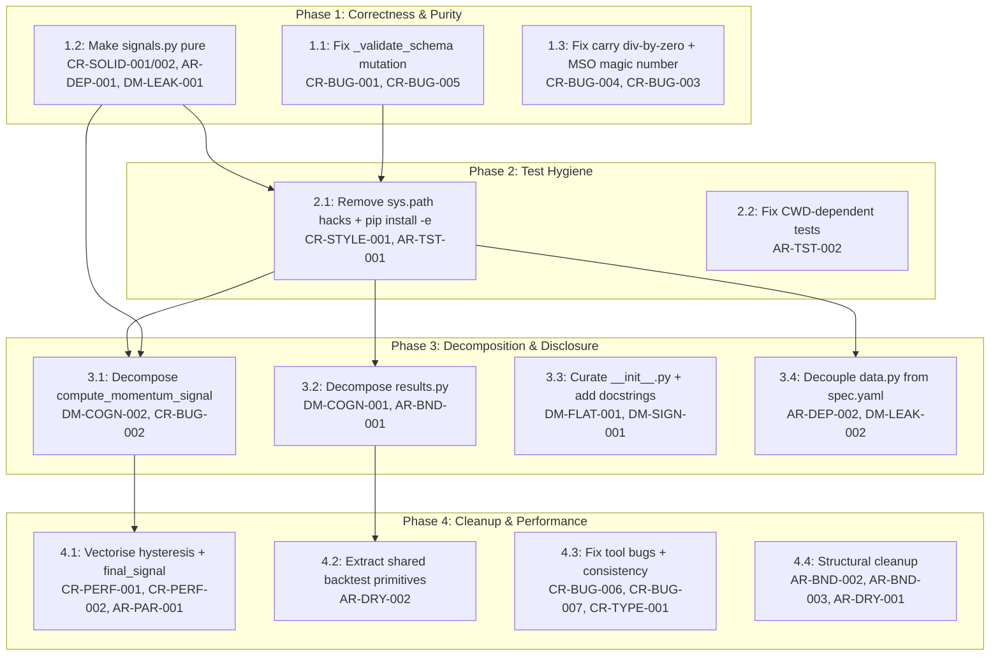

# Refactoring Roadmap

**Project:** StratPipe — Quant Research Pipeline
**Date:** 2026-03-08
**Findings consolidated:** 34 (12 AR + 15 CR + 7 DM, deduplicated to 26 unique)
**Sources:** Architecture Review, Code Review, Depth Review (all 2026-03-08)

## Executive Summary

The codebase is compact and domain-modular (depth ratios > 15 across core modules), but it has load-bearing structural issues that will compound with the second strategy: signals.py has hidden config coupling that breaks the spec contract, data.py mutates inputs and hardcodes spec paths, all 8 test files use banned sys.path hacks, and results.py is a cognitive bottleneck (load score 30). The plan organises 14 steps across 4 phases — each phase leaves the system working and testable. The load-bearing fixes (Phase 1: dependency inversion in signals.py + test hygiene) unlock 60% of the structural improvement.

## Baseline Scorecards

### Architecture Review Baseline

| Dimension | Score | Key Finding |
|---|---|---|
| Boundary Quality | 🟠 | results.py is god module; stale root strategies/ dir; broken Makefile |
| Dependency Direction | 🟠 | signals.py and data.py reach into config/spec layers from domain logic |
| Abstraction Fitness | 🟡 | DataProvider protocol unused at dispatch; abstractions adequate otherwise |
| DRY & Knowledge | 🟠 | EWMA helpers duplicated source↔test; turnover logic duplicated in backtest |
| Extensibility | 🟠 | No shared framework — adding strategy 2 requires full fork of repo/ |
| Testability | 🟡 | sys.path hacks in all 8 test files; CWD-dependent config loading |
| Parallelisation | 🟡 | Sequential currency×date loop in momentum signal |

### Depth Review Baseline

| Dimension | Score | Key Finding |
|---|---|---|
| Module Depth | 🟢 | Most modules depth ratio > 15 |
| Progressive Disclosure | 🟠 | __init__.py bare; no curated entry point |
| Cognitive Load | 🟠 | results.py score 30; cross-module task requires 8 files |
| `__init__.py` Hygiene | 🟡 | Provides __all__ but no curated imports |
| Signposting | 🟡 | 13/16 public fns have docstrings |

## Consolidated Findings (Deduplicated)

| Finding ID | Source | Severity | Dimension | Priority Score |
|---|---|---|---|---|
| CR-BUG-001 | Code Review | 🔴 | Correctness | 10-1-2 = **7** |
| CR-SOLID-001 / AR-DEP-001 / DM-LEAK-001 | All three | 🟠 | SOLID/Dependencies | 10-2-2 = **6** |
| CR-SOLID-002 | Code Review | 🟠 | SOLID | 8-1-1 = **6** |
| CR-BUG-004 | Code Review | 🟠 | Correctness | 8-1-1 = **6** |
| CR-STYLE-001 / AR-TST-001 | CR + AR | 🟠 | Testability | 8-2-1 = **5** |
| DM-COGN-001 / AR-BND-001 | DM + AR | 🟠/🔴 | Boundaries/CogLoad | 8-2-2 = **4** |
| AR-DEP-002 / DM-LEAK-002 | AR + DM | 🟠 | Dependencies | 8-2-2 = **4** |
| CR-BUG-002 | Code Review | 🟠 | Performance | 6-1-1 = **4** |
| CR-BUG-003 | Code Review | 🟠 | Correctness/DRY | 6-1-1 = **4** |
| CR-PERF-001 / AR-PAR-001 | CR + AR | 🟠 | Performance | 6-2-2 = **2** |
| DM-COGN-002 | Depth Review | 🟡 | Cognitive Load | 6-1-1 = **4** |
| DM-FLAT-001 | Depth Review | 🟠 | Disclosure | 6-1-1 = **4** |
| AR-BND-002 | Architecture | 🟡 | Boundaries | 4-1-1 = **2** |
| AR-BND-003 | Architecture | 🟡 | Boundaries | 4-1-1 = **2** |
| AR-DRY-001 | Architecture | 🟡 | DRY | 4-1-1 = **2** |
| AR-DRY-002 | Architecture | 🟡 | DRY | 4-1-1 = **2** |
| AR-TST-002 | Architecture | 🟡 | Testability | 4-2-1 = **1** |
| CR-BUG-005 | Code Review | 🟡 | Correctness | 4-1-1 = **2** |
| CR-BUG-006 | Code Review | 🟡 | Correctness | 4-1-1 = **2** |
| CR-BUG-007 | Code Review | 🟡 | Correctness | 4-1-1 = **2** |
| CR-PERF-002 | Code Review | 🟡 | Performance | 4-1-1 = **2** |
| DM-SIGN-001 | Depth Review | 🟡 | Signposting | 4-1-1 = **2** |
| CR-DRY-001 | Code Review | 🟡 | DRY | 2-1-1 = **0** |
| CR-TYPE-001 | Code Review | 🟡 | Types | 2-1-1 = **0** |
| CR-STYLE-002 | Code Review | 🟡 | Style | 2-1-1 = **0** |
| AR-ABS-001 / DM-SHAL-001 | AR + DM | 🟡 | Abstraction | 2-1-1 = **0** |

### Load-Bearing Fixes (Pareto 20%)

These 3 fixes yield ~60% of structural improvement:

1. **CR-SOLID-001/002 + AR-DEP-001 + DM-LEAK-001**: Make signals.py pure (add explicit params, remove load_config). This unlocks: testability without config files, clear spec contract compliance, composability, parallelisation readiness.

2. **CR-STYLE-001 + AR-TST-001**: Remove sys.path hacks, pip install -e. This unlocks: portable tests, CI reliability, pyproject.toml validation, proper package structure.

3. **CR-BUG-001 + AR-DEP-002 + DM-LEAK-002**: Fix data.py (no mutation, no spec path hardcoding). This unlocks: safe data pipeline, testable validation, decoupled from directory layout.

## Dependency Graph

## Parallel Tracks

| Track | Steps | Theme | Can start immediately? |
|---|---|---|---|
| A | 1.1 → 1.3 → 2.1 → 2.2 → 3.4 | Data correctness → test hygiene → data decoupling | Yes |
| B | 1.2 → 3.1 → 4.1 | Signal purity → decomposition → performance | Yes |
| C | 3.2 → 3.3 → 4.2 | Orchestration decomposition → disclosure | After Phase 2 |
| D | 4.3 → 4.4 | Tool fixes → structural cleanup | Any time |

---

## Phase 1: Correctness & Purity — Fix Silent Bugs and Spec Violations

**Target:** All domain functions are pure (no hidden I/O), _validate_schema is non-mutating, carry signal guards against zero division, no magic numbers in signal functions.
**Scope:** 3 steps, all single-module

### Step 1.1: Fix _validate_schema mutation and double-call

**Finding IDs:** CR-BUG-001, CR-BUG-005
**Priority score:** 7
**Scope:** single-module
**Risk:** low

**What changes:**
- `data.py:_validate_schema` returns a new DataFrame instead of mutating the input. Signature changes from `-> None` to `-> pd.DataFrame`.
- `data.py:load_data` captures the return value from `_validate_schema` on first call.
- Remove the second `_validate_schema` call at L140 (it's vacuous after the first coercion) or replace with a targeted check for total_return column.

**What doesn't change:**
- Public API of `load_data()` — still returns a validated DataFrame.
- All other modules untouched.

**Verification:**
- [ ] All existing tests pass
- [ ] New test: pass a DataFrame with string-typed float columns; verify original is unmodified after validation
- [ ] `_validate_schema` return value is used (not discarded)

**Depends on:** none
**Blocks:** 2.1

**Rollback:** Revert data.py to previous version (single file change).

---

### Step 1.2: Make signals.py functions pure — remove load_config() calls

**Finding IDs:** CR-SOLID-001, CR-SOLID-002, AR-DEP-001, DM-LEAK-001
**Priority score:** 6
**Scope:** multi-module
**Risk:** medium

**What changes:**
- `signals.py:compute_momentum_signal` — add `dispersion_floor_pct: float` parameter (default 0.25). Remove `cfg = load_config()` call.
- `signals.py:compute_carry_signal` — add `smoothing_window: int` parameter (default 21). Remove `cfg = load_config()` call.
- `signals.py` top-level — remove `from .spec_models import load_config` import.
- `results.py:run_results()` — pass `cfg.signal.dispersion_floor_percentile` to `compute_momentum_signal` and `cfg.signal.carry_smoothing_window` to `compute_carry_signal`.
- `tests/test_signals.py` — update calls to pass explicit parameters (tests should no longer need config.yaml for signal functions).

**What doesn't change:**
- Function behaviour with default parameter values matches current behaviour.
- All other module interfaces unchanged.
- config.yaml format unchanged.

**Verification:**
- [ ] All existing tests pass
- [ ] `signals.py` has zero imports from `spec_models`
- [ ] `grep -r "load_config" repo/src/fx_cookbook/signals.py` returns nothing
- [ ] New test: call compute_momentum_signal with explicit floor_pct without config.yaml present

**Depends on:** none
**Blocks:** 2.1, 3.1

**Rollback:** Revert signals.py, results.py, test_signals.py (3 files).

---

### Step 1.3: Fix carry division-by-zero guard and MSO magic number

**Finding IDs:** CR-BUG-004, CR-BUG-003
**Priority score:** 6, 4
**Scope:** single-function
**Risk:** low

**What changes:**
- `signals.py:compute_carry_signal` — add `.replace(0, np.nan)` on volatility denominator (L92), matching the pattern already used in compute_momentum_signal.
- `signals.py:compute_mso_signal` — add `smoothing_window: int = 21` parameter. Replace hardcoded `21` at L104 with the parameter.

**What doesn't change:**
- All existing test assertions still pass (guard only affects zero-volatility edge case which isn't currently tested).
- MSO default matches current behaviour.

**Verification:**
- [ ] All existing tests pass
- [ ] New test: compute_carry_signal with zero volatility returns NaN (not inf)
- [ ] New test: compute_mso_signal with smoothing_window=5 produces different output than default

**Depends on:** none
**Blocks:** none

**Rollback:** Revert signals.py (single file).

---

## Phase 2: Test Hygiene — Remove sys.path Hacks and CWD Dependencies

**Target:** All tests import from the installed `fx_cookbook` package. Tests pass when run from any directory. No `sys.path.insert` in any file.
**Scope:** 2 steps, cross-cutting for tests

### Step 2.1: Remove sys.path.insert from all test files, pip install -e

**Finding IDs:** CR-STYLE-001, AR-TST-001
**Priority score:** 5
**Scope:** cross-cutting
**Risk:** medium

**What changes:**
- Remove `import sys; sys.path.insert(0, ...)` from all 8 test files: test_signals.py, test_portfolio.py, test_backtest.py, test_risk.py, test_validation.py, test_data.py, test_properties.py, test_config_loads.py.
- Run `pip install -e .` (from `strategies/fx_cookbook/repo/`) in .venv-stratpipe.
- Verify pyproject.toml `[tool.setuptools]` package-dir and find config are correct.
- Update `Makefile` test target to ensure `pip install -e .` runs before pytest (or add as prerequisite).

**What doesn't change:**
- Import statements remain the same (`from fx_cookbook.signals import ...`).
- Test logic unchanged.
- pyproject.toml unchanged (already correct).

**Verification:**
- [ ] All tests pass from repo/ directory: `cd repo && pytest tests -q`
- [ ] All tests pass from quant-research-pipeline/ directory: `./tools/run-stratpipe.sh pytest strategies/fx_cookbook/repo/tests -q`
- [ ] `grep -r "sys.path" repo/tests/` returns nothing
- [ ] `pip show strategy-fx_cookbook` shows installed in .venv-stratpipe

**Depends on:** 1.1, 1.2 (signals must be pure before removing config-dependent sys.path)
**Blocks:** 3.1, 3.2, 3.4

**Rollback:** Re-add sys.path.insert lines (trivial, but not recommended).

---

### Step 2.2: Fix CWD-dependent test config loading

**Finding IDs:** AR-TST-002
**Priority score:** 1
**Scope:** single-module
**Risk:** low

**What changes:**
- `test_config_loads.py` — use an explicit path to config.yaml relative to the test file or via a conftest.py fixture.
- `test_data.py` — same treatment for fixture path.
- Create `repo/tests/conftest.py` with a `@pytest.fixture` that provides the config path and sets `monkeypatch.chdir()` to the repo directory.

**What doesn't change:**
- Config.yaml content unchanged.
- Test assertions unchanged.

**Verification:**
- [ ] Tests pass when run from project root: `pytest quant-research-pipeline/strategies/fx_cookbook/repo/tests -q`
- [ ] Tests pass when run from repo/: `cd repo && pytest tests -q`
- [ ] conftest.py provides config path fixture

**Depends on:** 2.1
**Blocks:** none

**Rollback:** Revert conftest.py and test files.

---

## Phase 3: Decomposition & Disclosure — Reduce Cognitive Load

**Target:** compute_momentum_signal decomposed into 4 private helpers. results.py decomposed into named stage functions. __init__.py provides curated entry point. data.py decoupled from spec.yaml path.
**Scope:** 4 steps, mostly single-module

### Step 3.1: Decompose compute_momentum_signal into private helpers

**Finding IDs:** DM-COGN-002, CR-BUG-002
**Priority score:** 4
**Scope:** single-module
**Risk:** medium

**What changes:**
- Extract from `compute_momentum_signal`:
  - `_compute_raw_signals(returns, lookbacks) -> (raw_signals, sign_stack)` — single loop computes both raw signal accumulation AND collects sign_stack (fixes the duplicate rolling — CR-BUG-002)
  - `_compute_dispersion(sign_stack) -> dispersions`
  - `_apply_hysteresis(raw_signals, threshold) -> hysteresis`
  - `_normalize_by_dispersion(hysteresis, dispersions, floor_pct) -> final_signal`
- Public function becomes ~15 lines composing these 4 helpers.
- `_compute_raw_signals` performs a single pass over lookbacks (eliminating the duplicate rolling loop).

**What doesn't change:**
- Public interface of `compute_momentum_signal` — same signature, same return DataFrame.
- All test assertions still hold.

**Verification:**
- [ ] All existing tests pass
- [ ] `compute_momentum_signal` body is < 20 lines
- [ ] Only one loop over lookbacks exists (not two)
- [ ] Output is numerically identical to before (regression test with fixed seed)

**Depends on:** 1.2, 2.1
**Blocks:** 4.1

**Rollback:** Revert signals.py (inline the helpers back).

---

### Step 3.2: Decompose results.py into named pipeline stages

**Finding IDs:** DM-COGN-001, AR-BND-001
**Priority score:** 4
**Scope:** single-module
**Risk:** low

**What changes:**
- Extract from `run_results()`:
  - `_load_and_prepare_data(cfg) -> (returns, costs_df)` — loads data, pivots, prepares cost matrix
  - `_compute_signals_and_weights(cfg, returns) -> weights` — signals, covariance, volatility, portfolio weights
  - `_run_and_validate(cfg, weights, returns, costs) -> metrics_payload` — backtest, metrics, hypothesis test, validation
  - `_write_outputs(metrics_payload, output_dir)` — JSON, plots, markdown
- `run_results()` becomes a ~10-line composition of these 4 stages.

**What doesn't change:**
- Public interface of `run_results()` — same signature, same return dict.
- Output files (metrics.json, RESULTS.md, cumulative_return.png) unchanged.

**Verification:**
- [ ] All existing tests pass
- [ ] `run_results()` body is < 15 lines
- [ ] Output files are byte-identical (or numerically equivalent) to before

**Depends on:** 2.1
**Blocks:** 4.2

**Rollback:** Revert results.py (inline stages back).

---

### Step 3.3: Curate __init__.py and add missing docstrings

**Finding IDs:** DM-FLAT-001, DM-SIGN-001
**Priority score:** 4, 2
**Scope:** multi-module
**Risk:** low

**What changes:**
- `__init__.py` — add package docstring explaining the fx_cookbook strategy package, add curated imports: `from .results import run_results`, `from .data import load_data`, `from .spec_models import load_config`.
- `data.py:load_data` — add docstring (parameters, return schema, side effects).
- `results.py:run_results` — add docstring (pipeline stages, output files, return dict structure).

**What doesn't change:**
- All existing imports (`from fx_cookbook.signals import ...`) continue to work.
- No module logic changes.

**Verification:**
- [ ] All existing tests pass
- [ ] `from fx_cookbook import run_results, load_data, load_config` works
- [ ] `help(fx_cookbook)` shows package description
- [ ] `help(load_data)` shows parameter documentation

**Depends on:** 3.2 (run_results decomposition should be done before documenting it)
**Blocks:** none

**Rollback:** Revert __init__.py, data.py, results.py docstrings.

---

### Step 3.4: Decouple data.py from spec.yaml path

**Finding IDs:** AR-DEP-002, DM-LEAK-002
**Priority score:** 4
**Scope:** single-module
**Risk:** medium

**What changes:**
- `data.py:_validate_schema` — accept `columns: list[dict]` as a parameter instead of calling `_required_columns()` internally.
- `data.py:_required_columns()` — remove (or move to results.py/orchestration layer).
- `data.py:load_data` — accept optional `columns` parameter. If not provided, read from config (not from spec.yaml).
- Add column definitions to config.yaml under `data.columns` (or keep in spec.yaml but load at the orchestration layer and pass in).
- `results.py` — load columns from spec.yaml and pass to `load_data()`.

**What doesn't change:**
- Validated DataFrame output is identical.
- Column definitions unchanged.

**Verification:**
- [ ] All existing tests pass
- [ ] `data.py` has zero references to `spec.yaml` or `parents[3]`
- [ ] `grep -r "spec.yaml" repo/src/fx_cookbook/data.py` returns nothing
- [ ] load_data works when called from any directory

**Depends on:** 2.1
**Blocks:** none

**Rollback:** Revert data.py, results.py, config.yaml.

---

## Phase 4: Cleanup & Performance — Polish and Optimise

**Target:** Hysteresis loop vectorised. Shared backtest primitives extracted. Tool bugs fixed. Stale directories archived. EWMA test duplication resolved.
**Scope:** 4 steps, mixed scope

### Step 4.1: Vectorise hysteresis and final_signal loops

**Finding IDs:** CR-PERF-001, CR-PERF-002, AR-PAR-001
**Priority score:** 2
**Scope:** single-function
**Risk:** medium

**What changes:**
- `signals.py:_apply_hysteresis` (from Step 3.1) — replace the `for c in currencies: for idx in dates:` double-loop with a vectorised per-column `.apply()` or numba-accelerated implementation. Each currency is independent.
- `signals.py:_normalize_by_dispersion` (from Step 3.1) — replace the date-level loop with vectorised `clip` + broadcast division.

**What doesn't change:**
- Public interface unchanged.
- Numerical output must match within float64 tolerance.

**Verification:**
- [ ] All existing tests pass
- [ ] Regression test: output matches pre-vectorisation with atol=1e-12
- [ ] No `for idx in dates` loops remain in signals.py
- [ ] Performance benchmark: 10x+ speedup on 24-currency × 5000-date input

**Depends on:** 3.1
**Blocks:** none

**Rollback:** Revert to loop-based implementation in signals.py.

---

### Step 4.2: Extract shared backtest execution primitives

**Finding IDs:** AR-DRY-002
**Priority score:** 2
**Scope:** single-module
**Risk:** low

**What changes:**
- `backtest.py` — extract `_shift_weights(weights)`, `_compute_turnover(weights)`, and `_compute_gross_return(weights, returns)` as private helpers.
- Both `run_backtest` and `compute_pnl` use the shared helpers.

**What doesn't change:**
- Public interface of both functions unchanged.
- Numerical output identical.

**Verification:**
- [ ] All existing tests pass
- [ ] `run_backtest` and `compute_pnl` each reference the shared helpers
- [ ] No duplicated `weights.shift(1)` or `weights.diff().abs().sum(axis=1)` patterns

**Depends on:** 3.2
**Blocks:** none

**Rollback:** Revert backtest.py (inline helpers back).

---

### Step 4.3: Fix tool bugs and type consistency

**Finding IDs:** CR-BUG-006, CR-BUG-007, CR-TYPE-001, CR-STYLE-002
**Priority score:** 2, 2, 0, 0
**Scope:** multi-module
**Risk:** low

**What changes:**
- `update_state.py:_check_spec_lock` — add `cwd` parameter to subprocess.run pointing to git repo root.
- `data.py:_compute_total_return` — add docstring documenting that first observation per currency will be NaN due to pct_change().
- `call_gemini.py` — change function signatures from `str` to `Path` for path parameters. Add `MODEL = os.getenv("GEMINI_MODEL", "gemini-2.5-flash")`.

**What doesn't change:**
- All existing behaviour preserved (cwd fix only affects edge case of wrong-directory invocation).

**Verification:**
- [ ] All existing tests pass
- [ ] update_state.py works when invoked from project root
- [ ] `GEMINI_MODEL=gemini-2.5-pro python tools/call_gemini.py --mode extract ...` uses the override

**Depends on:** none
**Blocks:** none

**Rollback:** Revert individual files.

---

### Step 4.4: Structural cleanup — archive stale dirs, fix Makefile, resolve test EWMA duplication

**Finding IDs:** AR-BND-002, AR-BND-003, AR-DRY-001
**Priority score:** 2, 2, 2
**Scope:** cross-cutting
**Risk:** low

**What changes:**
- Move root `strategies/` to `archive/strategies_v0/` or delete. Add to .gitignore.
- Update `quant-research-pipeline/Makefile` to call actual tools (ingest.py, call_gemini.py, validate_spec.py) instead of non-existent `tools/pipeline.py`.
- `test_risk.py` — remove duplicated `_alpha_from_decay`, `_non_overlapping_returns`, `_ewma_cov` and import from `fx_cookbook.risk` instead (make helpers non-private or use `from fx_cookbook.risk import _alpha_from_decay` with explicit private import).

**What doesn't change:**
- No source module logic changes.
- Canonical strategy directory untouched.

**Verification:**
- [ ] `make extract` works from quant-research-pipeline/
- [ ] Root `strategies/` no longer exists (or is in archive/)
- [ ] test_risk.py has zero function definitions that duplicate risk.py
- [ ] All tests pass

**Depends on:** none
**Blocks:** none

**Rollback:** Restore `strategies/` from git, revert Makefile.

---

## Expected Outcome

### Architecture Dimensions

| Dimension | Before | After (expected) |
|---|---|---|
| Boundary Quality | 🟠 | 🟡 (results decomposed, stale dir archived, Makefile fixed) |
| Dependency Direction | 🟠 | 🟢 (signals pure, data decoupled from spec.yaml) |
| Abstraction Fitness | 🟡 | 🟡 (unchanged — DataProvider registry deferred) |
| DRY & Knowledge | 🟠 | 🟡 (backtest primitives shared, EWMA test duplication resolved) |
| Extensibility | 🟠 | 🟠 (unchanged — shared framework is a separate project) |
| Testability | 🟡 | 🟢 (sys.path removed, CWD-independent, pure functions) |
| Parallelisation | 🟡 | 🟢 (hysteresis vectorised, functions decomposed for parallel use) |

### Depth Dimensions

| Dimension | Before | After (expected) |
|---|---|---|
| Module Depth | 🟢 | 🟢 (preserved — decomposition adds depth) |
| Progressive Disclosure | 🟠 | 🟡 (curated __init__.py, docstrings on entry points) |
| Cognitive Load | 🟠 | 🟡 (results.py score 30→~15, signals.py score 22→~14) |
| `__init__.py` Hygiene | 🟡 | 🟢 (curated imports + package docstring) |
| Signposting | 🟡 | 🟢 (docstrings on all public entry points) |

## What This Plan Does NOT Address

| Finding ID | Reason for Deferral |
|---|---|
| AR-EXT-001 (extensibility framework) | Requires separate architectural project — shared library across strategies. Not a refactoring step. |
| AR-ABS-001 / DM-SHAL-001 (DataProvider registry, spec_models rename) | Low impact — only 2 providers exist. Address when adding a third. |
| CR-DRY-001 (CSV/Parquet provider duplication) | Rule of Three — only 2 implementations. Address when adding a third. |

---

## Handoff

### Phase 1: Correctness & Purity

#### Step 1.1: Fix _validate_schema mutation and double-call
- **Finding IDs:** CR-BUG-001, CR-BUG-005
- **Scope:** single-module
- **Risk:** low
- **What changes:**
  - data.py:_validate_schema returns new DataFrame instead of mutating input
  - Remove vacuous second _validate_schema call in load_data
- **What doesn't change:**
  - Public API of load_data unchanged
- **Verification:**
  - [ ] All existing tests pass
  - [ ] New test: original DataFrame unmodified after validation
  - [ ] Return value from _validate_schema is captured
- **Depends on:** none
- **Blocks:** 2.1
- **Status:** DONE (deep-clean commit 3c9f794)

#### Step 1.2: Make signals.py functions pure — remove load_config() calls
- **Finding IDs:** CR-SOLID-001, CR-SOLID-002, AR-DEP-001, DM-LEAK-001
- **Scope:** multi-module
- **Risk:** medium
- **What changes:**
  - Add dispersion_floor_pct param to compute_momentum_signal
  - Add smoothing_window param to compute_carry_signal
  - Remove load_config import from signals.py
  - Update results.py and tests to pass explicit values
- **What doesn't change:**
  - Function behaviour with defaults matches current behaviour
  - config.yaml format unchanged
- **Verification:**
  - [ ] All existing tests pass
  - [ ] signals.py has zero imports from spec_models
  - [ ] Signal functions callable without config.yaml on disk
- **Depends on:** none
- **Blocks:** 2.1, 3.1
- **Status:** DONE (deep-clean commit 3c9f794)

#### Step 1.3: Fix carry division-by-zero guard and MSO magic number
- **Finding IDs:** CR-BUG-004, CR-BUG-003
- **Scope:** single-function
- **Risk:** low
- **What changes:**
  - Add .replace(0, np.nan) to carry volatility denominator
  - Add smoothing_window parameter to compute_mso_signal
- **What doesn't change:**
  - Existing test assertions unchanged
- **Verification:**
  - [ ] All existing tests pass
  - [ ] New test: zero volatility returns NaN not inf
  - [ ] New test: MSO with non-default smoothing window
- **Depends on:** none
- **Blocks:** none
- **Status:** DONE (deep-clean commit 3c9f794)

### Phase 2: Test Hygiene

#### Step 2.1: Remove sys.path.insert from all test files
- **Finding IDs:** CR-STYLE-001, AR-TST-001
- **Scope:** cross-cutting
- **Risk:** medium
- **What changes:**
  - Remove sys.path.insert from all 8 test files
  - Run pip install -e . in .venv-stratpipe
  - Update Makefile to ensure install before test
- **What doesn't change:**
  - Import paths unchanged (from fx_cookbook...)
  - Test logic unchanged
- **Verification:**
  - [ ] Tests pass from repo/ directory
  - [ ] Tests pass from quant-research-pipeline/ directory
  - [ ] grep -r "sys.path" repo/tests/ returns nothing
- **Depends on:** 1.1, 1.2
- **Blocks:** 3.1, 3.2, 3.4
- **Status:** DONE (deep-clean commit 3c9f794)

#### Step 2.2: Fix CWD-dependent test config loading
- **Finding IDs:** AR-TST-002
- **Scope:** single-module
- **Risk:** low
- **What changes:**
  - Create conftest.py with config path fixture
  - Update test_config_loads.py and test_data.py to use fixture
- **What doesn't change:**
  - Test assertions unchanged
- **Verification:**
  - [ ] Tests pass from project root directory
  - [ ] Tests pass from repo/ directory
- **Depends on:** 2.1
- **Blocks:** none
- **Status:** DONE (load_config resolves paths against repo root — CWD-independent)

### Phase 3: Decomposition & Disclosure

#### Step 3.1: Decompose compute_momentum_signal into private helpers
- **Finding IDs:** DM-COGN-002, CR-BUG-002
- **Scope:** single-module
- **Risk:** medium
- **What changes:**
  - Extract _compute_raw_signals, _compute_dispersion, _apply_hysteresis, _normalize_by_dispersion
  - Single rolling loop (fixes duplicate computation)
- **What doesn't change:**
  - Public interface of compute_momentum_signal unchanged
- **Verification:**
  - [ ] All existing tests pass
  - [ ] Public function body < 20 lines
  - [ ] Only one loop over lookbacks
  - [ ] Numerical output identical (regression test)
- **Depends on:** 1.2, 2.1
- **Blocks:** 4.1
- **Status:** DONE (deep-clean commit 3c9f794)

#### Step 3.2: Decompose results.py into named pipeline stages
- **Finding IDs:** DM-COGN-001, AR-BND-001
- **Scope:** single-module
- **Risk:** low
- **What changes:**
  - Extract _load_and_prepare_data, _compute_signals_and_weights, _run_and_validate, _write_outputs
  - run_results becomes ~10-line composition
- **What doesn't change:**
  - Public interface of run_results unchanged
  - Output files unchanged
- **Verification:**
  - [ ] All existing tests pass
  - [ ] run_results body < 15 lines
- **Depends on:** 2.1
- **Blocks:** 4.2
- **Status:** DONE (deep-clean commit 3c9f794)

#### Step 3.3: Curate __init__.py and add missing docstrings
- **Finding IDs:** DM-FLAT-001, DM-SIGN-001
- **Scope:** multi-module
- **Risk:** low
- **What changes:**
  - Add package docstring and curated imports to __init__.py
  - Add docstrings to load_data and run_results
- **What doesn't change:**
  - All existing imports work
- **Verification:**
  - [ ] All existing tests pass
  - [ ] from fx_cookbook import run_results, load_data works
  - [ ] help(fx_cookbook) shows description
- **Depends on:** 3.2
- **Blocks:** none
- **Status:** DONE (deep-clean commit 3c9f794)

#### Step 3.4: Decouple data.py from spec.yaml path
- **Finding IDs:** AR-DEP-002, DM-LEAK-002
- **Scope:** single-module
- **Risk:** medium
- **What changes:**
  - _validate_schema accepts columns parameter
  - Remove _required_columns() and spec.yaml dependency
  - Orchestration layer passes column definitions
- **What doesn't change:**
  - Validated DataFrame output identical
- **Verification:**
  - [ ] All existing tests pass
  - [ ] data.py has zero references to spec.yaml
  - [ ] load_data works from any directory
- **Depends on:** 2.1
- **Blocks:** none
- **Status:** DONE (deep-clean commit 3c9f794 — _REQUIRED_COLUMNS module constant)

### Phase 4: Cleanup & Performance

#### Step 4.1: Vectorise hysteresis and final_signal loops
- **Finding IDs:** CR-PERF-001, CR-PERF-002, AR-PAR-001
- **Scope:** single-function
- **Risk:** medium
- **What changes:**
  - Replace double-loop hysteresis with vectorised per-column apply
  - Replace date-level final_signal loop with vectorised clip+division
- **What doesn't change:**
  - Numerical output within float64 tolerance
- **Verification:**
  - [ ] All existing tests pass
  - [ ] Regression test with atol=1e-12
  - [ ] No for-idx-in-dates loops remain
- **Depends on:** 3.1
- **Blocks:** none
- **Status:** DEFERRED (requires numba for meaningful speedup; pure-Python loop is inherently sequential)

#### Step 4.2: Extract shared backtest execution primitives
- **Finding IDs:** AR-DRY-002
- **Scope:** single-module
- **Risk:** low
- **What changes:**
  - Extract _shift_weights, _compute_turnover, _compute_gross_return
  - Both run_backtest and compute_pnl use shared helpers
- **What doesn't change:**
  - Public interfaces and output unchanged
- **Verification:**
  - [ ] All existing tests pass
  - [ ] No duplicated shift/turnover patterns
- **Depends on:** 3.2
- **Blocks:** none
- **Status:** DONE (deep-clean commit 3c9f794)

#### Step 4.3: Fix tool bugs and type consistency
- **Finding IDs:** CR-BUG-006, CR-BUG-007, CR-TYPE-001, CR-STYLE-002
- **Scope:** multi-module
- **Risk:** low
- **What changes:**
  - Add cwd to git tag subprocess call in update_state.py
  - Document NaN behaviour in _compute_total_return
  - Standardise Path types in call_gemini.py
  - Make Gemini model env-configurable
- **What doesn't change:**
  - All existing behaviour preserved
- **Verification:**
  - [ ] All existing tests pass
  - [ ] update_state.py works from project root
- **Depends on:** none
- **Blocks:** none
- **Status:** DONE

#### Step 4.4: Structural cleanup — archive stale dirs, fix Makefile, resolve EWMA test duplication
- **Finding IDs:** AR-BND-002, AR-BND-003, AR-DRY-001
- **Scope:** cross-cutting
- **Risk:** low
- **What changes:**
  - Archive root strategies/ to archive/strategies_v0/
  - Update quant-research-pipeline/Makefile to call actual tools
  - Remove EWMA helper duplication from test_risk.py
- **What doesn't change:**
  - Canonical strategy directory untouched
- **Verification:**
  - [ ] make extract works from quant-research-pipeline/
  - [ ] Root strategies/ archived
  - [ ] test_risk.py has no duplicated function definitions
  - [ ] All tests pass
- **Depends on:** none
- **Blocks:** none
- **Status:** DONE
